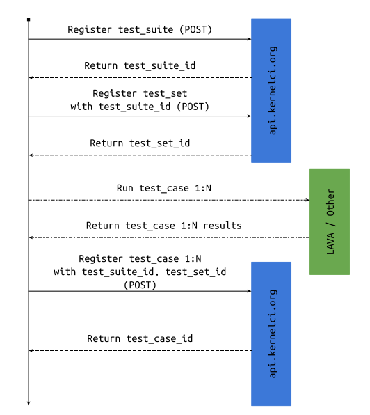
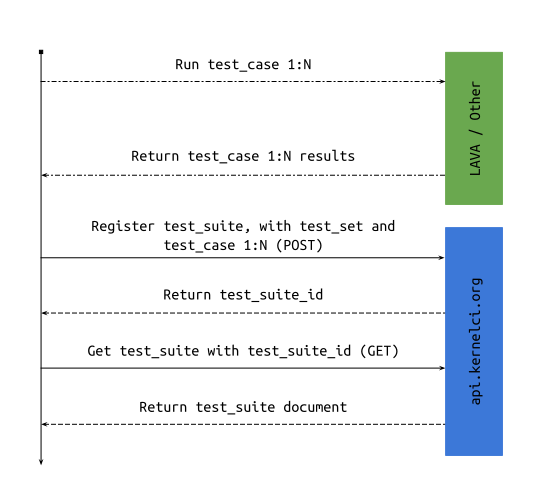

.. _collection_test:

test
----

The ``test`` resource is a collection of multiple resources.

.. note:: All the resources listed here can be accessed using either the singular form (**test**) or the plural form (**tests**).

.. toctree::
   :maxdepth: 2

   collection-test-suite
   collection-test-set
   collection-test-case

How to Use the Test Resources
+++++++++++++++++++++++++++++

In order to register tests and to use the test APIs at the best, the following
user cases describe how to interact with the resources available.

The following are just ideas on how to implement the data flow between the tests
runner and the API. They all have pros and cons.

.. note::
    If you send (POST) multiple times the same request to register a test suite
    with the same values, multiple test suites will be registered. To update a test
    suite perform a PUT request. The same principle applies to the other test
    resources.

Register Test Sets and Cases One at the Time
********************************************

In the following example, the user first registers the test suite obtaining its
``test_suite_id``, that is then used to register the test set to obtain the
``test_set_id`` value.

She then runs all her test cases, and as soon as the first result comes back,
she registers the test case using the ``test_suite_id`` and ``test_set_id``
values. The last step is repeated for all the **N** test cases she runs.

The following are examples of the JSON data snippet that might be used in this
scenario. The order is: test suite data, test set data, test case data
(for each test cases):

.. sourcecode:: json

    {
        "name": "A test suite"
    }

.. sourcecode:: json

    {
        "name": "A test set",
        "test_suite_id": "a-test-suite-id"
    }

.. sourcecode:: json

    {
        "name": "A test case 1…N",
        "test_suite_id": "a-test-suite-id",
        "test_set_id": "a-test-set-id"
    }

Pros
~~~~

* Small amount of data are sent with each HTTP request.
* Easy to see the flow of the data, and in case interrupt it.
* If a test case run is damaged or does not return any results, it can be
  retried before being sent.
* The reference for each registered resource is obtained with the server
  response.

Cons
~~~~

* Necessary to perform an HTTP POST request for each step: one for the test
  suite, one for the test set, and one for each test case.

Register Test Suite, Set and Cases Together
*******************************************

In the following example, the user registers everything with a single request
(POST) with all the data embedded in the same JSON document.

This means that the results of the test cases must be available when sending
the data

The following is an example of the JSON data snippet that might be used in this
scenario:

.. sourcecode:: json

    {
        "name": "A test suite"
        "test_set": [
            {
                "name": "A test set",
                "test_case": [
                    {
                        "name": "A test case 1…N"
                    }
                ]
            }
        ]
    }

Note that even if the ``test_suite_id`` field is mandatory for test sets and
test cases, as specified in their JSON schema, in this case it is not necessary:
it will be injected into the provided data after the test suite has been saved.

Pros
~~~~

* Less number of HTTP POST requests to register all the resources.
* Tests can be re-run if errors arise during the execution.

Cons
~~~~

* The data sent might be big, depending on the number of test sets and test
  cases included.
* Necessary to perform an extra HTTP GET request to obtain all the test references.

Register Test Suite and Set, Update Test Set
********************************************

In the following example, the user registers the test suite and test set each
by itself obtaining their own ID values. She then runs all the test cases, and
once all the results have been collected, updates the test set with a single
request (PUT).

The following are examples of the JSON data snippet that might be used in this
scenario. The order is: test suite data, test set data, updated test set data:

.. sourcecode:: json

    {
        "name": "A test suite"
    }

.. sourcecode:: json

    {
        "name": "A test set",
        "test_suite_id": "a-test-suite-id"
    }

.. sourcecode:: json

    {
        "test_case": [
            {
                "name": "A test case 1…N"
            }
        ]
    }

Note that even if the ``test_suite_id`` field is mandatory for test cases, as
specified in their JSON schema, in this case it is not necessary: it will be
injected into the provided data and will be taken from the test set.

Pros
~~~~

* Less HTTP POST requests to send all data.

Cons
~~~~

* Necessary to perform an extra HTTP GET request to obtain all the test references.
* The HTTP PUT request data might be big, depending on the number of test cases
  run.

